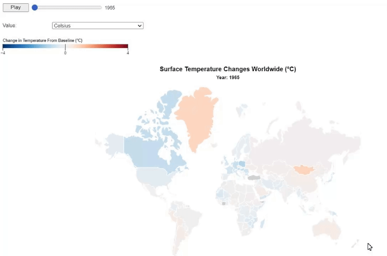
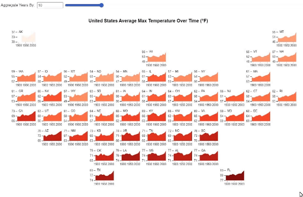
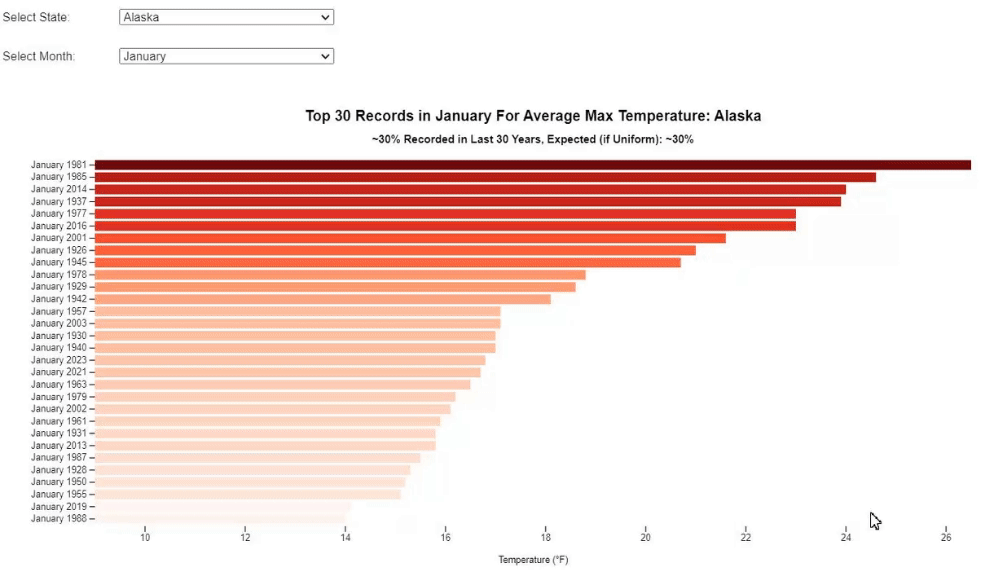
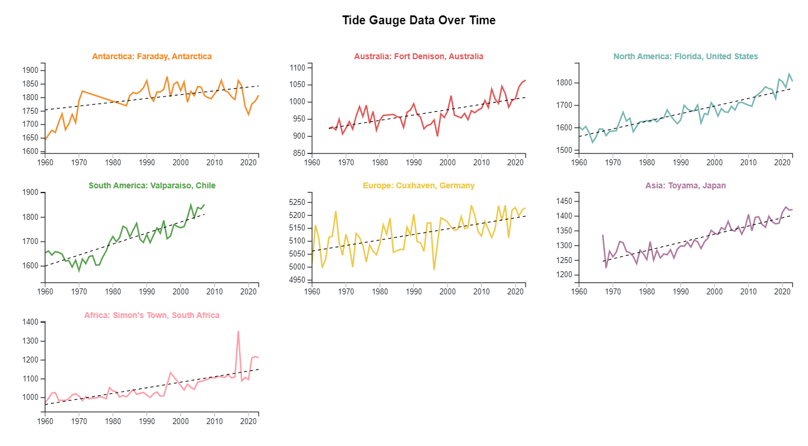

# Climate Change Visualization

Authors: Ahhyun Moon, Kevin Zheng

## Overview

 Repository for Information Visualization Final Project. 
 
 Full details available in observable notebook:

[Link to Observable](https://observablehq.com/d/26d8adb0fc1882ad)

## Sample Visualizations

**Visualizing Surface Temperature Changes Globally**

**Visualizing Surface Temperature Changes in United States**

**Visualizing Max Temperature Records in US by State**

**Visualizing Tide Data Globally**

